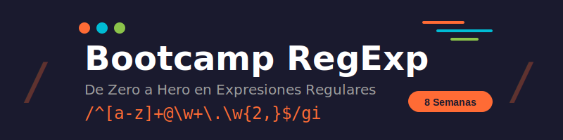

<p align="center">
  
</p>

# 🎯 Bootcamp de Expresiones Regulares

> **De Zero a Hero en 8 semanas** | 4 horas semanales | 32 horas totales

## 📋 Descripción

Domina las **expresiones regulares (RegExp)** desde los fundamentos hasta técnicas avanzadas. Este bootcamp te llevará de no saber nada sobre regex a poder crear patrones complejos para validación, extracción y manipulación de texto.

## 🗓️ Temario

| Semana | Tema                      | Descripción                                       |
| :----: | ------------------------- | ------------------------------------------------- |
|   01   | **Fundamentos**           | Literales, metacaracteres básicos (`.`, `^`, `$`) |
|   02   | **Clases de Caracteres**  | `[abc]`, `[^abc]`, `\d`, `\w`, `\s` y más         |
|   03   | **Cuantificadores**       | `*`, `+`, `?`, `{n,m}`, greedy vs lazy            |
|   04   | **Grupos y Capturas**     | `()`, `(?:)`, backreferences `\1`                 |
|   05   | **Lookahead/Lookbehind**  | `(?=)`, `(?!)`, `(?<=)`, `(?<!)`                  |
|   06   | **Flags y Modificadores** | `g`, `i`, `m`, `s`, `u`                           |
|   07   | **Patrones Avanzados**    | Optimización y rendimiento                        |
|   08   | **Proyecto Final**        | Casos reales y aplicaciones prácticas             |

## 📁 Estructura del Proyecto

```
bc-regexp/
├── 📂 assets/             # Recursos globales (imágenes, SVGs)
├── 📂 _docs/              # Documentación general
├── 📂 _scripts/           # Scripts de utilidad
└── 📂 bootcamp/
    └── 📂 week-XX-tema_principal/
        ├── 📂 0-assets/       # Recursos de la semana
        ├── 📂 1-teoria/       # Contenido teórico
        ├── 📂 2-ejercicios/   # Ejercicios prácticos
        ├── 📂 3-proyecto/     # Mini-proyecto semanal
        ├── 📂 4-resursos/     # Enlaces externos
        └── 📂 5-glosario/     # Términos y definiciones
```

## 🛠️ Herramientas Recomendadas

| Herramienta | Descripción                     | Enlace                               |
| ----------- | ------------------------------- | ------------------------------------ |
| regex101    | Tester online con explicaciones | [regex101.com](https://regex101.com) |
| RegExr      | Visualizador interactivo        | [regexr.com](https://regexr.com)     |
| Debuggex    | Diagramas de flujo              | [debuggex.com](https://debuggex.com) |

## 🚀 Cómo Empezar

1. **Clona el repositorio**

   ```bash
   git clone https://github.com/tu-usuario/bc-regexp.git
   cd bc-regexp
   ```

2. **Navega a la semana actual**

   ```bash
   cd bootcamp/week-01-fundamentos_y_metacaracteres
   ```

3. **Sigue el orden sugerido**
   - Lee la teoría en `1-teoria/`
   - Practica con los ejercicios en `2-ejercicios/`
   - Aplica lo aprendido en `3-proyecto/`

## 📊 Distribución Semanal (4 horas)

```
┌─────────────────────────────────────────────┐
│  📖 Teoría          │████████░░░░│  1 hora  │
│  💻 Ejercicios      │████████████████░░░░│  2 horas │
│  🔨 Mini-proyecto   │████████░░░░│  1 hora  │
└─────────────────────────────────────────────┘
```

## 🎓 Requisitos Previos

- Conocimientos básicos de programación
- Editor de código (VS Code recomendado)
- Ganas de aprender 💪

## 📝 Licencia

Este proyecto está bajo la Licencia MIT.

---

<p align="center">
  <strong>¿Listo para dominar las expresiones regulares?</strong><br>
  <code>/^Comienza.*ahora$/</code>
</p>
