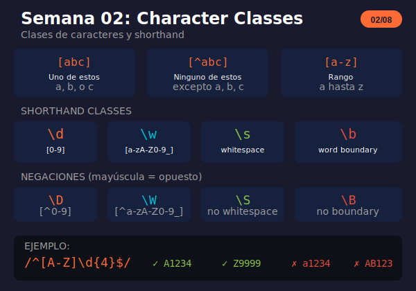

# Semana 02: Character Classes

<p align="center">
  
</p>

## 🎯 Objetivos de la Semana

Al finalizar esta semana serás capaz de:

- Crear character classes personalizadas con `[abc]`
- Usar rangos como `[a-z]`, `[0-9]`, `[A-Za-z]`
- Aplicar negación con `[^...]`
- Dominar los shorthand: `\d`, `\w`, `\s` y sus negaciones
- Usar word boundaries (`\b`) para encontrar palabras completas

## 📚 Contenido

### Teoría

| Archivo                                                       | Tema                                           | Duración |
| ------------------------------------------------------------- | ---------------------------------------------- | -------- |
| [01-character-classes.md](1-teoria/01-character-classes.md)   | Character classes, rangos, negación, shorthand | 30 min   |
| [02-shorthand-avanzado.md](1-teoria/02-shorthand-avanzado.md) | Word boundary, combinaciones, comparaciones    | 30 min   |

### Ejercicios

| Archivo                                                                             | Descripción            |
| ----------------------------------------------------------------------------------- | ---------------------- |
| [ejercicio-02-character-classes.md](2-ejercicios/ejercicio-02-character-classes.md) | 6 ejercicios + desafío |
| [solucion-02-character-classes.md](2-ejercicios/solucion-02-character-classes.md)   | Soluciones explicadas  |

### Proyecto

| Archivo                                                                           | Descripción                    |
| --------------------------------------------------------------------------------- | ------------------------------ |
| [proyecto-02-validador-contacto.md](3-proyecto/proyecto-02-validador-contacto.md) | Validador de datos de contacto |
| [solucion-proyecto-02.js](3-proyecto/solucion-proyecto-02.js)                     | Solución del proyecto          |

### Recursos y Glosario

| Archivo                                                   | Descripción                                 |
| --------------------------------------------------------- | ------------------------------------------- |
| [recursos-semana-02.md](4-resursos/recursos-semana-02.md) | Herramientas, tutoriales, referencia rápida |
| [glosario-semana-02.md](5-glosario/glosario-semana-02.md) | Términos técnicos                           |

## ⏱️ Distribución del Tiempo (4 horas)

```
┌────────────────────────────────────────────────────┐
│  📖 Teoría                    │ 1 hora            │
│  💻 Ejercicios                │ 1.5 horas         │
│  🔨 Proyecto                  │ 1 hora            │
│  📝 Revisión y glosario       │ 0.5 horas         │
└────────────────────────────────────────────────────┘
```

## 🧠 Conceptos Clave

| Concepto        | Sintaxis | Ejemplo      | Descripción               |
| --------------- | -------- | ------------ | ------------------------- |
| Character class | `[abc]`  | `/[aeiou]/`  | Uno de estos caracteres   |
| Negación        | `[^abc]` | `/[^0-9]/`   | Ninguno de estos          |
| Rango           | `[a-z]`  | `/[A-Za-z]/` | Rango de caracteres       |
| Dígito          | `\d`     | `/\d{5}/`    | Equivale a `[0-9]`        |
| Word char       | `\w`     | `/\w+/`      | Equivale a `[a-zA-Z0-9_]` |
| Whitespace      | `\s`     | `/\s+/`      | Espacios, tabs, newlines  |
| Word boundary   | `\b`     | `/\bcat\b/`  | Límite de palabra         |

## ✅ Checklist de Progreso

- [ ] Leer teoría de character classes
- [ ] Leer teoría de shorthand avanzado
- [ ] Completar ejercicios 1-6
- [ ] Intentar el desafío extra
- [ ] Completar el proyecto del validador de contacto
- [ ] Revisar el glosario

## 🔗 Recursos Rápidos

- 🧪 [regex101.com](https://regex101.com) - Tester online
- 📖 [RegexOne Lesson 3-5](https://regexone.com) - Character classes
- 📚 [MDN Character Classes](https://developer.mozilla.org/en-US/docs/Web/JavaScript/Guide/Regular_Expressions/Character_Classes)

## 💡 Tips de la Semana

```javascript
// \d es más legible que [0-9]
/\d\d\d\d/  // ✅ Claro
/[0-9][0-9][0-9][0-9]/  // ❌ Verboso

// Usa \b para palabras completas
/\bcat\b/  // Solo "cat", no "category"

// El orden importa en []
/[-a-z]/  // Guión literal + rango
/[a-z-]/  // Rango + guión literal
/[a\-z]/  // a, guión, z (escapado)
```

---

**Anterior:** [Semana 01 - Fundamentos](../semana-01/)

**Siguiente:** [Semana 03 - Cuantificadores](../semana-03/)
