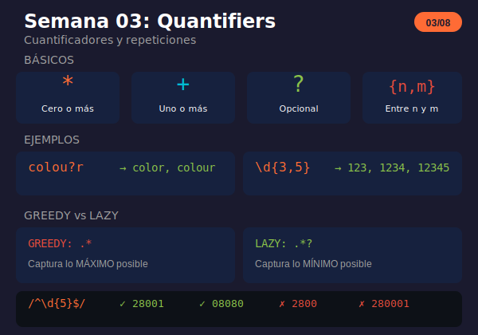

# Semana 03: Quantifiers (Cuantificadores)

<p align="center">
  
</p>

## 🎯 Objetivos de la Semana

Al finalizar esta semana serás capaz de:

- Usar quantifiers básicos: `*`, `+`, `?`
- Especificar repeticiones exactas con `{n}`, `{n,m}`, `{n,}`
- Entender la diferencia entre greedy y lazy
- Aplicar quantifiers para validaciones y extracciones reales

## 📚 Contenido

### Teoría

| Archivo                                               | Tema                             | Duración |
| ----------------------------------------------------- | -------------------------------- | -------- |
| [01-quantifiers.md](1-teoria/01-quantifiers.md)       | Quantifiers básicos y con llaves | 30 min   |
| [02-greedy-vs-lazy.md](1-teoria/02-greedy-vs-lazy.md) | Comportamiento greedy y lazy     | 30 min   |

### Ejercicios

| Archivo                                                                 | Descripción                           |
| ----------------------------------------------------------------------- | ------------------------------------- |
| [ejercicio-03-quantifiers.md](2-ejercicios/ejercicio-03-quantifiers.md) | 6 ejercicios + desafío parser de logs |
| [solucion-03-quantifiers.md](2-ejercicios/solucion-03-quantifiers.md)   | Soluciones explicadas                 |

### Proyecto

| Archivo                                                         | Descripción                 |
| --------------------------------------------------------------- | --------------------------- |
| [proyecto-03-extractor.md](3-proyecto/proyecto-03-extractor.md) | Extractor de datos de texto |
| [solucion-proyecto-03.js](3-proyecto/solucion-proyecto-03.js)   | Solución del proyecto       |

### Recursos y Glosario

| Archivo                                                   | Descripción                    |
| --------------------------------------------------------- | ------------------------------ |
| [recursos-semana-03.md](4-resursos/recursos-semana-03.md) | Herramientas, patrones comunes |
| [glosario-semana-03.md](5-glosario/glosario-semana-03.md) | Términos técnicos              |

## ⏱️ Distribución del Tiempo (4 horas)

```
┌────────────────────────────────────────────────────┐
│  📖 Teoría                    │ 1 hora            │
│  💻 Ejercicios                │ 1.5 horas         │
│  🔨 Proyecto                  │ 1 hora            │
│  📝 Revisión y glosario       │ 0.5 horas         │
└────────────────────────────────────────────────────┘
```

## 🧠 Conceptos Clave

| Quantifier | Significado      | Ejemplo                   |
| ---------- | ---------------- | ------------------------- |
| `*`        | Cero o más       | `ab*c` → ac, abc, abbc    |
| `+`        | Uno o más        | `ab+c` → abc, abbc        |
| `?`        | Opcional (0 o 1) | `colou?r` → color, colour |
| `{n}`      | Exactamente n    | `\d{5}` → 12345           |
| `{n,m}`    | Entre n y m      | `\d{3,5}` → 123 a 12345   |
| `{n,}`     | Al menos n       | `\d{3,}` → 123, 1234...   |
| `*?` `+?`  | Lazy (mínimo)    | `".*?"` → match corto     |

## ✅ Checklist de Progreso

- [ ] Leer teoría de quantifiers básicos
- [ ] Leer teoría de greedy vs lazy
- [ ] Completar ejercicios 1-6
- [ ] Completar desafío parser de logs
- [ ] Completar el proyecto extractor
- [ ] Revisar el glosario

## 🔗 Recursos Rápidos

- 🧪 [regex101.com](https://regex101.com) - Visualiza el backtracking
- 📖 [JavaScript.info Quantifiers](https://javascript.info/regexp-quantifiers)
- 📖 [Greedy and Lazy](https://javascript.info/regexp-greedy-and-lazy)

## 💡 Tips de la Semana

```javascript
// Validar longitud exacta
/^\d{5}$/          // Código postal: 5 dígitos

// Longitud flexible
/^\w{8,16}$/       // Password: 8-16 caracteres

// Elemento opcional
/https?/           // http o https

// Greedy vs Lazy
/".*"/             // Todo entre primera y última "
/".*?"/            // Cada string individual

// Alternativa eficiente a lazy
/"[^"]*"/          // Negación en lugar de .*?
```

---

**Anterior:** [Semana 02 - Character Classes](../semana-02/)

**Siguiente:** [Semana 04 - Grupos y Capturas](../semana-04/)
