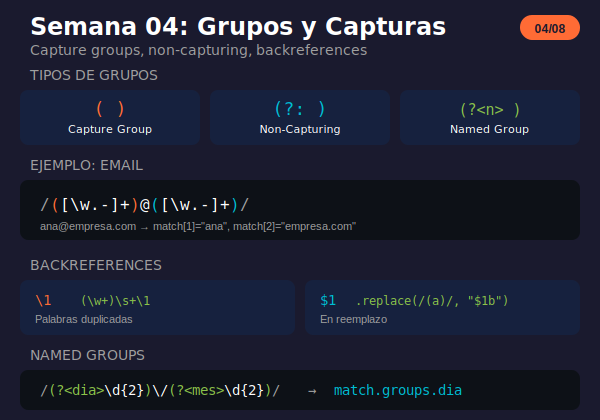

# Semana 04: Grupos y Capturas

<p align="center">
  
</p>

## 🎯 Objetivos de la Semana

Al finalizar esta semana serás capaz de:

- Usar capture groups `()` para extraer partes del match
- Aplicar non-capturing groups `(?:)` para agrupar sin capturar
- Implementar named groups `(?<nombre>)` para código legible
- Usar backreferences `\1` y `$1` para referenciar grupos
- Combinar grupos con métodos de JavaScript

## 📚 Contenido

### Teoría

| Archivo                                               | Tema                                 | Duración |
| ----------------------------------------------------- | ------------------------------------ | -------- |
| [01-grupos-captura.md](1-teoria/01-grupos-captura.md) | Capture groups, non-capturing, named | 35 min   |
| [02-backreferences.md](1-teoria/02-backreferences.md) | Referencias a grupos capturados      | 25 min   |

### Ejercicios

| Archivo                                                       | Descripción                          |
| ------------------------------------------------------------- | ------------------------------------ |
| [ejercicio-04-grupos.md](2-ejercicios/ejercicio-04-grupos.md) | 7 ejercicios + desafío parser de URL |
| [solucion-04-grupos.md](2-ejercicios/solucion-04-grupos.md)   | Soluciones explicadas                |

### Proyecto

| Archivo                                                       | Descripción                  |
| ------------------------------------------------------------- | ---------------------------- |
| [proyecto-04-parser.md](3-proyecto/proyecto-04-parser.md)     | Parser de logs multi-formato |
| [solucion-proyecto-04.js](3-proyecto/solucion-proyecto-04.js) | Solución del proyecto        |

### Recursos y Glosario

| Archivo                                                   | Descripción                  |
| --------------------------------------------------------- | ---------------------------- |
| [recursos-semana-04.md](4-resursos/recursos-semana-04.md) | Herramientas, patrones, tips |
| [glosario-semana-04.md](5-glosario/glosario-semana-04.md) | Términos técnicos            |

## ⏱️ Distribución del Tiempo (4 horas)

```
┌────────────────────────────────────────────────────┐
│  📖 Teoría                    │ 1 hora            │
│  💻 Ejercicios                │ 1.5 horas         │
│  🔨 Proyecto                  │ 1 hora            │
│  📝 Revisión y glosario       │ 0.5 horas         │
└────────────────────────────────────────────────────┘
```

## 🧠 Conceptos Clave

| Concepto      | Sintaxis         | Descripción                      |
| ------------- | ---------------- | -------------------------------- |
| Capture Group | `(...)`          | Captura texto para uso posterior |
| Non-Capturing | `(?:...)`        | Agrupa sin capturar              |
| Named Group   | `(?<nombre>...)` | Captura con nombre               |
| Backreference | `\1`, `\k<n>`    | Referencia en patrón             |
| Replace Ref   | `$1`, `$<n>`     | Referencia en replace            |

## ✅ Checklist de Progreso

- [ ] Leer teoría de grupos de captura
- [ ] Leer teoría de backreferences
- [ ] Completar ejercicios 1-7
- [ ] Completar desafío parser de URL
- [ ] Completar el proyecto parser de logs
- [ ] Revisar el glosario

## 🔗 Recursos Rápidos

- 🧪 [regex101.com](https://regex101.com) - Visualiza grupos en tiempo real
- 📖 [MDN Groups](https://developer.mozilla.org/en-US/docs/Web/JavaScript/Guide/Regular_Expressions/Groups_and_Backreferences)
- 📖 [JavaScript.info Groups](https://javascript.info/regexp-groups)

## 💡 Tips de la Semana

```javascript
// Capture group básico
const match = "15/01/2024".match(/(\d{2})\/(\d{2})\/(\d{4})/);
console.log(match[1]); // "15"

// Named groups (más legible)
const match2 = "15/01/2024".match(/(?<dia>\d{2})\/(?<mes>\d{2})\/(?<anio>\d{4})/);
const { dia, mes, anio } = match2.groups;

// Non-capturing (no aparece en resultado)
/(?:https?):\/\/(\w+)/  // Solo captura el dominio

// Backreference (texto repetido)
/(\w+)\s+\1/gi  // Encuentra "el el", "la la"

// En replace
"García, Juan".replace(/(.+),\s*(.+)/, "$2 $1");
// "Juan García"

// matchAll (mantiene grupos con flag g)
for (const m of texto.matchAll(/(\w+)@(\w+)/g)) {
  console.log(m[1], m[2]);
}
```

---

**Anterior:** [Semana 03 - Quantifiers](../semana-03/)

**Siguiente:** [Semana 05 - Lookahead y Lookbehind](../semana-05/)
