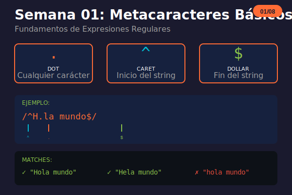

# Semana 01: Fundamentos de RegExp

<p align="center">
  
</p>

## 🎯 Objetivos de la Semana

Al finalizar esta semana serás capaz de:

- Entender qué son las expresiones regulares y para qué sirven
- Usar literales para buscar texto exacto
- Dominar los metacaracteres básicos: `.`, `^`, `$`, `\`
- Aplicar los métodos de JavaScript para trabajar con regex

## 📚 Contenido

### Teoría

| Archivo                                                         | Tema                                    | Duración |
| --------------------------------------------------------------- | --------------------------------------- | -------- |
| [01-introduccion-regexp.md](1-teoria/01-introduccion-regexp.md) | Introducción, literales, metacaracteres | 30 min   |
| [02-metodos-javascript.md](1-teoria/02-metodos-javascript.md)   | Métodos: test, match, replace, etc.     | 30 min   |

### Ejercicios

| Archivo                                                                 | Descripción                  |
| ----------------------------------------------------------------------- | ---------------------------- |
| [ejercicio-01-fundamentos.md](2-ejercicios/ejercicio-01-fundamentos.md) | 5 ejercicios + desafío extra |
| [solucion-01-fundamentos.md](2-ejercicios/solucion-01-fundamentos.md)   | Soluciones explicadas        |

### Proyecto

| Archivo                                                         | Descripción                      |
| --------------------------------------------------------------- | -------------------------------- |
| [proyecto-01-validador.md](3-proyecto/proyecto-01-validador.md) | Validador de códigos de producto |
| [solucion-proyecto-01.js](3-proyecto/solucion-proyecto-01.js)   | Solución del proyecto            |

### Recursos y Glosario

| Archivo                                                   | Descripción                      |
| --------------------------------------------------------- | -------------------------------- |
| [recursos-semana-01.md](4-resursos/recursos-semana-01.md) | Herramientas, tutoriales, libros |
| [glosario-semana-01.md](5-glosario/glosario-semana-01.md) | Términos técnicos                |

## ⏱️ Distribución del Tiempo (4 horas)

```
┌────────────────────────────────────────────────────┐
│  📖 Teoría                    │ 1 hora            │
│  💻 Ejercicios                │ 1.5 horas         │
│  🔨 Proyecto                  │ 1 hora            │
│  📝 Revisión y glosario       │ 0.5 horas         │
└────────────────────────────────────────────────────┘
```

## 🧠 Conceptos Clave

| Concepto  | Símbolo | Descripción          |
| --------- | ------- | -------------------- |
| Literal   | `abc`   | Texto exacto         |
| Dot       | `.`     | Cualquier carácter   |
| Caret     | `^`     | Inicio del string    |
| Dollar    | `$`     | Fin del string       |
| Backslash | `\`     | Escape de caracteres |

## ✅ Checklist de Progreso

- [ ] Leer teoría de introducción
- [ ] Leer teoría de métodos JavaScript
- [ ] Completar ejercicios 1-5
- [ ] Intentar el desafío extra
- [ ] Completar el proyecto del validador
- [ ] Revisar el glosario

## 🔗 Recursos Rápidos

- 🧪 [regex101.com](https://regex101.com) - Tester online
- 📖 [RegexOne](https://regexone.com) - Tutorial interactivo
- 🎮 [Regex Crossword](https://regexcrossword.com) - Practica jugando

---

**Siguiente:** [Semana 02 - Character Classes](../week-02-character_classes/)
