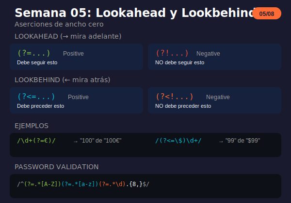

# Semana 05: Lookahead y Lookbehind

<p align="center">
  
</p>

## 🎯 Objetivos de la Semana

Al finalizar esta semana serás capaz de:

- Usar positive lookahead `(?=...)` para verificar lo que sigue
- Usar negative lookahead `(?!...)` para excluir patrones
- Usar positive lookbehind `(?<=...)` para verificar lo anterior
- Usar negative lookbehind `(?<!...)` para excluir por contexto
- Combinar lookarounds para validaciones complejas

## 📚 Contenido

### Teoría

| Archivo                                                           | Tema                  | Duración |
| ----------------------------------------------------------------- | --------------------- | -------- |
| [01-lookahead-lookbehind.md](1-teoria/01-lookahead-lookbehind.md) | Lookarounds completos | 60 min   |

### Ejercicios

| Archivo                                                                 | Descripción                               |
| ----------------------------------------------------------------------- | ----------------------------------------- |
| [ejercicio-05-lookarounds.md](2-ejercicios/ejercicio-05-lookarounds.md) | 7 ejercicios + desafío syntax highlighter |
| [solucion-05-lookarounds.md](2-ejercicios/solucion-05-lookarounds.md)   | Soluciones explicadas                     |

### Proyecto

| Archivo                                                         | Descripción                       |
| --------------------------------------------------------------- | --------------------------------- |
| [proyecto-05-validador.md](3-proyecto/proyecto-05-validador.md) | Validador de formularios avanzado |
| [solucion-proyecto-05.js](3-proyecto/solucion-proyecto-05.js)   | Solución del proyecto             |

### Recursos y Glosario

| Archivo                                                   | Descripción                  |
| --------------------------------------------------------- | ---------------------------- |
| [recursos-semana-05.md](4-resursos/recursos-semana-05.md) | Herramientas, patrones, tips |
| [glosario-semana-05.md](5-glosario/glosario-semana-05.md) | Términos técnicos            |

## ⏱️ Distribución del Tiempo (4 horas)

```
┌────────────────────────────────────────────────────┐
│  📖 Teoría                    │ 1 hora            │
│  💻 Ejercicios                │ 1.5 horas         │
│  🔨 Proyecto                  │ 1 hora            │
│  📝 Revisión y glosario       │ 0.5 horas         │
└────────────────────────────────────────────────────┘
```

## 🧠 Conceptos Clave

| Tipo                | Sintaxis   | Descripción      | Ejemplo          |
| ------------------- | ---------- | ---------------- | ---------------- |
| Positive Lookahead  | `(?=...)`  | Debe seguir      | `\d+(?=€)`       |
| Negative Lookahead  | `(?!...)`  | NO debe seguir   | `Java(?!Script)` |
| Positive Lookbehind | `(?<=...)` | Debe preceder    | `(?<=\$)\d+`     |
| Negative Lookbehind | `(?<!...)` | NO debe preceder | `(?<!\$)\d+`     |

## ✅ Checklist de Progreso

- [ ] Leer teoría de lookarounds
- [ ] Completar ejercicios 1-7
- [ ] Completar desafío syntax highlighter
- [ ] Completar el proyecto validador
- [ ] Revisar el glosario

## 🔗 Recursos Rápidos

- 🧪 [regex101.com](https://regex101.com) - Explica lookarounds
- 📖 [MDN Assertions](https://developer.mozilla.org/en-US/docs/Web/JavaScript/Guide/Regular_Expressions/Assertions)
- 📖 [JavaScript.info Lookaround](https://javascript.info/regexp-lookahead-lookbehind)

## 💡 Tips de la Semana

```javascript
// Lookahead: verificar sin incluir
/\d+(?=€)/.exec("100€");     // ['100'] sin €

// Lookbehind: verificar lo anterior
/(?<=\$)\d+/.exec("$99");    // ['99'] sin $

// Negative: excluir patrones
/Java(?!Script)/             // Java pero no JavaScript

// Password validation con múltiples lookaheads
/^(?=.*[A-Z])(?=.*[a-z])(?=.*\d).{8,}$/

// Separador de miles
"1234567".replace(/\B(?=(\d{3})+(?!\d))/g, ",");
// "1,234,567"

// Zero-width: no consumen texto
// El cursor no avanza después del lookaround
```

## ⚠️ Compatibilidad

```javascript
// Lookbehind requiere ES2018+
// No funciona en: IE, Safari < 16.4

// Alternativa para lookbehind:
// En lugar de:
/(?<=\$)\d+/

// Usar grupo y extraer:
/\$(\d+)/.exec("$100")[1]  // "100"
```

---

**Anterior:** [Semana 04 - Grupos y Capturas](../week-04-grupos_y_backreferences/)

**Siguiente:** [Semana 06 - Flags y Modificadores](../week-06-flags_y_modificadores/)
