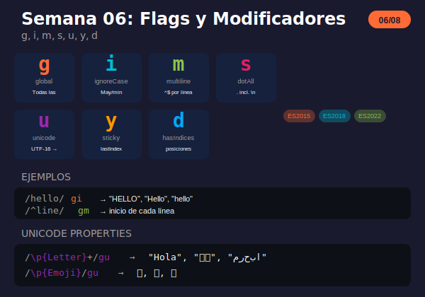

# Semana 06: Flags y Modificadores

<p align="center">
  
</p>

## 🎯 Objetivos de la Semana

Al finalizar esta semana serás capaz de:

- Usar flag `g` para búsquedas globales
- Usar flag `i` para búsquedas case-insensitive
- Usar flag `m` para procesamiento multilínea
- Usar flag `s` para capturar bloques con saltos de línea
- Usar flag `u` para soporte Unicode completo
- Usar flags `y` y `d` para casos especiales

## 📚 Contenido

### Teoría

| Archivo                                                         | Tema                        | Duración |
| --------------------------------------------------------------- | --------------------------- | -------- |
| [01-flags-modificadores.md](1-teoria/01-flags-modificadores.md) | Todos los flags disponibles | 60 min   |

### Ejercicios

| Archivo                                                     | Descripción                       |
| ----------------------------------------------------------- | --------------------------------- |
| [ejercicio-06-flags.md](2-ejercicios/ejercicio-06-flags.md) | 7 ejercicios + desafío log parser |
| [solucion-06-flags.md](2-ejercicios/solucion-06-flags.md)   | Soluciones explicadas             |

### Proyecto

| Archivo                                                       | Descripción                |
| ------------------------------------------------------------- | -------------------------- |
| [proyecto-06-buscador.md](3-proyecto/proyecto-06-buscador.md) | Buscador de texto avanzado |
| [solucion-proyecto-06.js](3-proyecto/solucion-proyecto-06.js) | Solución del proyecto      |

### Recursos y Glosario

| Archivo                                                   | Descripción                 |
| --------------------------------------------------------- | --------------------------- |
| [recursos-semana-06.md](4-resursos/recursos-semana-06.md) | Herramientas, Unicode, tips |
| [glosario-semana-06.md](5-glosario/glosario-semana-06.md) | Términos técnicos           |

## ⏱️ Distribución del Tiempo (4 horas)

```
┌────────────────────────────────────────────────────┐
│  📖 Teoría                    │ 1 hora            │
│  💻 Ejercicios                │ 1.5 horas         │
│  🔨 Proyecto                  │ 1 hora            │
│  📝 Revisión y glosario       │ 0.5 horas         │
└────────────────────────────────────────────────────┘
```

## 🧠 Conceptos Clave

| Flag | Nombre     | Descripción             | ES     |
| ---- | ---------- | ----------------------- | ------ |
| `g`  | global     | Todas las coincidencias | ES3    |
| `i`  | ignoreCase | Ignora mayúsculas       | ES3    |
| `m`  | multiline  | ^$ por línea            | ES3    |
| `s`  | dotAll     | . incluye \n            | ES2018 |
| `u`  | unicode    | Soporte Unicode         | ES2015 |
| `y`  | sticky     | Solo en lastIndex       | ES2015 |
| `d`  | hasIndices | Índices de grupos       | ES2022 |

## ✅ Checklist de Progreso

- [ ] Leer teoría de flags
- [ ] Completar ejercicios 1-7
- [ ] Completar desafío log parser
- [ ] Completar el proyecto buscador
- [ ] Revisar el glosario

## 🔗 Recursos Rápidos

- 🧪 [regex101.com](https://regex101.com) - Probar todos los flags
- 📖 [MDN Flags](https://developer.mozilla.org/en-US/docs/Web/JavaScript/Guide/Regular_Expressions#advanced_searching_with_flags)
- 📖 [Unicode Properties](https://developer.mozilla.org/en-US/docs/Web/JavaScript/Reference/Regular_expressions/Unicode_character_class_escape)

## 💡 Tips de la Semana

```javascript
// Flag g: encontrar todas
'abc abc abc'.match(/abc/g); // ['abc', 'abc', 'abc']

// Flag i: case-insensitive
/hello/i.test('HELLO'); // true

// Flag m: multilínea
`Línea 1
Línea 2`.match(/^Línea/gm); // ['Línea', 'Línea']

// Flag s: . incluye \n
'<div>\ncontent\n</div>'.match(/<div>.*<\/div>/s);

// Flag u: Unicode
'😀'.match(/./gu); // ['😀']
'Hola 你好'.match(/\p{L}+/gu); // ['Hola', '你好']

// Acceder a flags
const regex = /test/gi;
regex.flags; // "gi"
regex.global; // true
regex.ignoreCase; // true
```

## ⚠️ Advertencias

```javascript
// match() con g pierde grupos
'a@b.com'.match(/(\w+)@/g); // ['a@'] - sin grupo

// Usar matchAll para mantener grupos
for (const m of 'a@b.com'.matchAll(/(\w+)@/g)) {
  console.log(m[1]); // 'a'
}

// Compatibilidad
// s: ES2018+
// u: ES2015+
// d: ES2022+
```

---

**Anterior:** [Semana 05 - Lookahead y Lookbehind](../week-05-lookahead_y_lookbehind/)

**Siguiente:** [Semana 07 - Patrones Avanzados](../week-07-patrones_avanzados/)
