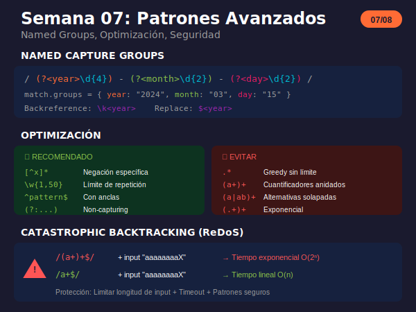

# Semana 07: Patrones Avanzados y Optimización

<p align="center">
  
</p>

## 🎯 Objetivos de la Semana

Al finalizar esta semana serás capaz de:

- Usar named capture groups para código más legible
- Optimizar patrones para mejor rendimiento
- Identificar y evitar catastrophic backtracking
- Crear tokenizers y parsers simples
- Aplicar técnicas de seguridad en regex

## 📚 Contenido

### Teoría

| Archivo                                                       | Tema                                  | Duración |
| ------------------------------------------------------------- | ------------------------------------- | -------- |
| [01-patrones-avanzados.md](1-teoria/01-patrones-avanzados.md) | Named groups, optimización, seguridad | 75 min   |

### Ejercicios

| Archivo                                                             | Descripción                            |
| ------------------------------------------------------------------- | -------------------------------------- |
| [ejercicio-07-avanzados.md](2-ejercicios/ejercicio-07-avanzados.md) | 7 ejercicios + desafío template parser |
| [solucion-07-avanzados.md](2-ejercicios/solucion-07-avanzados.md)   | Soluciones explicadas                  |

### Proyecto

| Archivo                                                       | Descripción             |
| ------------------------------------------------------------- | ----------------------- |
| [proyecto-07-linter.md](3-proyecto/proyecto-07-linter.md)     | Linter de código simple |
| [solucion-proyecto-07.js](3-proyecto/solucion-proyecto-07.js) | Solución del proyecto   |

### Recursos y Glosario

| Archivo                                                   | Descripción                         |
| --------------------------------------------------------- | ----------------------------------- |
| [recursos-semana-07.md](4-resursos/recursos-semana-07.md) | Herramientas, seguridad, benchmarks |
| [glosario-semana-07.md](5-glosario/glosario-semana-07.md) | Términos técnicos avanzados         |

## ⏱️ Distribución del Tiempo (4 horas)

```
┌────────────────────────────────────────────────────┐
│  📖 Teoría                    │ 1.25 horas        │
│  💻 Ejercicios                │ 1.5 horas         │
│  🔨 Proyecto                  │ 1 hora            │
│  📝 Revisión y glosario       │ 0.25 horas        │
└────────────────────────────────────────────────────┘
```

## 🧠 Conceptos Clave

| Concepto            | Sintaxis       | Uso                    |
| ------------------- | -------------- | ---------------------- |
| Named Group         | `(?<name>...)` | Grupos con nombre      |
| Named Backreference | `\k<name>`     | Referencia por nombre  |
| Named Replace       | `$<name>`      | En string de reemplazo |
| Atomic (simulado)   | `(?=(...))\\1` | Prevenir backtracking  |

## ✅ Checklist de Progreso

- [ ] Leer teoría de patrones avanzados
- [ ] Completar ejercicios 1-7
- [ ] Completar desafío template parser
- [ ] Completar el proyecto linter
- [ ] Revisar el glosario

## 🔗 Recursos Rápidos

- 🧪 [regex101.com](https://regex101.com) - Testing con debugger
- 📖 [Named Groups MDN](https://developer.mozilla.org/en-US/docs/Web/JavaScript/Reference/Regular_expressions/Named_capturing_group)
- ⚠️ [ReDoS Info](https://owasp.org/www-community/attacks/Regular_expression_Denial_of_Service_-_ReDoS)

## 💡 Tips de la Semana

```javascript
// Named capture groups
const date = /(?<year>\d{4})-(?<month>\d{2})-(?<day>\d{2})/;
'2024-03-15'.match(date).groups;
// { year: "2024", month: "03", day: "15" }

// Backreference con nombre
/(?<word>\w+)\s+\k<word>/.test('hello hello'); // true

// Replace con nombre
'2024-03-15'.replace(date, '$<day>/$<month>/$<year>');
// "15/03/2024"

// Optimización: evitar backtracking
// ❌ /(a+)+$/
// ✅ /a+$/

// Negación en lugar de .*
// ❌ /".*"/
// ✅ /"[^"]*"/
```

## ⚠️ Patrones Peligrosos

```javascript
// ❌ NUNCA usar estos patrones sin protección
/(a+)+$/          // Exponencial
/(.+)+$/          // Exponencial
/(a|aa)+/         // Backtracking excesivo
/(\w+\.)*\w+@/    // Email vulnerable

// Protección
// 1. Limitar longitud del input
// 2. Agregar timeout
// 3. Usar patrones específicos
```

## 🔒 Seguridad

```javascript
// Validar que un patrón sea seguro
function isSafe(pattern) {
  const dangerous = /\([^)]*[+*][^)]*\)[+*]/;
  return !dangerous.test(pattern.source);
}

// Limitar ejecución
function safeMatch(text, pattern, maxLen = 1000) {
  if (text.length > maxLen) {
    throw new Error('Input too long');
  }
  return text.match(pattern);
}
```

---

**Anterior:** [Semana 06 - Flags y Modificadores](../week-06-flags_y_modificadores/)

**Siguiente:** [Semana 08 - Proyecto Final](../week-08-proyecto_final/)
