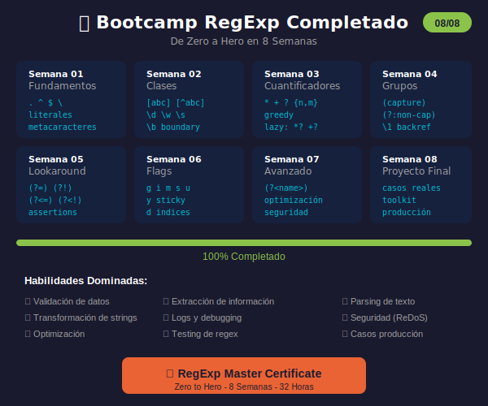

# Semana 08: Proyecto Final + Casos Reales

<p align="center">
  
</p>

## 🎯 Objetivos de la Semana

Al finalizar esta semana serás capaz de:

- Aplicar todo lo aprendido en un proyecto integral
- Resolver casos reales de la industria
- Crear una librería de patrones reutilizable
- Dominar debugging y testing de regex

## 📚 Contenido

### Teoría

| Archivo                                           | Tema                                         | Duración |
| ------------------------------------------------- | -------------------------------------------- | -------- |
| [01-casos-reales.md](1-teoria/01-casos-reales.md) | Resumen bootcamp, casos industria, debugging | 60 min   |

### Ejercicios

| Archivo                                                     | Descripción                                |
| ----------------------------------------------------------- | ------------------------------------------ |
| [ejercicio-08-final.md](2-ejercicios/ejercicio-08-final.md) | 7 ejercicios + desafío motor de plantillas |
| [solucion-08-final.md](2-ejercicios/solucion-08-final.md)   | Soluciones explicadas                      |

### Proyecto

| Archivo                                                             | Descripción                       |
| ------------------------------------------------------------------- | --------------------------------- |
| [proyecto-final.md](3-proyecto/proyecto-final.md)                   | RegEx Toolkit - Librería completa |
| [solucion-proyecto-final.js](3-proyecto/solucion-proyecto-final.js) | Implementación de referencia      |

### Recursos y Glosario

| Archivo                                                   | Descripción                     |
| --------------------------------------------------------- | ------------------------------- |
| [recursos-semana-08.md](4-resursos/recursos-semana-08.md) | Cheatsheet, patrones producción |
| [glosario-final.md](5-glosario/glosario-final.md)         | Glosario completo del bootcamp  |

## ⏱️ Distribución del Tiempo (4 horas)

```
┌────────────────────────────────────────────────────┐
│  📖 Teoría y repaso          │ 1 hora             │
│  💻 Ejercicios finales       │ 1 hora             │
│  🔨 Proyecto final           │ 1.5 horas          │
│  📝 Revisión y celebración   │ 0.5 horas          │
└────────────────────────────────────────────────────┘
```

## 🏆 Resumen del Bootcamp

| Semana | Tema            | Conceptos Clave                     |
| ------ | --------------- | ----------------------------------- |
| 01     | Fundamentos     | `.` `^` `$` `\` literales           |
| 02     | Clases          | `[abc]` `\d` `\w` `\s` `\b`         |
| 03     | Cuantificadores | `*` `+` `?` `{n,m}` greedy/lazy     |
| 04     | Grupos          | `()` `(?:)` `\1` backreference      |
| 05     | Lookaround      | `(?=)` `(?!)` `(?<=)` `(?<!)`       |
| 06     | Flags           | `g` `i` `m` `s` `u` `y` `d`         |
| 07     | Avanzado        | `(?<name>)` optimización, seguridad |
| 08     | Final           | Proyecto, casos reales              |

## ✅ Checklist Final

- [ ] Revisar resumen del bootcamp
- [ ] Completar ejercicios finales
- [ ] Implementar el proyecto RegEx Toolkit
- [ ] Crear tests para validadores
- [ ] Documentar la librería
- [ ] ¡Celebrar! 🎉

## 🔗 Recursos Rápidos

- 🧪 [regex101.com](https://regex101.com) - Testing
- 📖 [MDN RegExp](https://developer.mozilla.org/en-US/docs/Web/JavaScript/Reference/Global_Objects/RegExp)
- 📚 [Regular-Expressions.info](https://www.regular-expressions.info/)

## 💡 Patrones de Producción

```javascript
// Validadores
const email = /^[a-zA-Z0-9._%+-]+@[a-zA-Z0-9.-]+\.[a-zA-Z]{2,}$/;
const uuid =
  /^[0-9a-f]{8}-[0-9a-f]{4}-[1-5][0-9a-f]{3}-[89ab][0-9a-f]{3}-[0-9a-f]{12}$/i;
const semver =
  /^(0|[1-9]\d*)\.(0|[1-9]\d*)\.(0|[1-9]\d*)(-[\da-zA-Z-]+)?(\+[\da-zA-Z-]+)?$/;

// Extractores
const emails = /[a-zA-Z0-9._%+-]+@[a-zA-Z0-9.-]+\.[a-zA-Z]{2,}/g;
const urls = /https?:\/\/[^\s<>"{}|\\^`\[\]]+/g;
const hashtags = /#[a-zA-Z_]\w*/g;

// Transformadores
str.replace(/<[^>]+>/g, ''); // Strip HTML
str.replace(/\s+/g, ' ').trim(); // Normalize spaces
str.replace(/[A-Z]/g, (m) => '_' + m.toLowerCase()); // camelToSnake
```

---

## 🎓 ¡Felicitaciones!

Has completado el **Bootcamp de Expresiones Regulares**.

En 8 semanas has pasado de cero conocimiento a dominar:

- ✅ Sintaxis completa de regex
- ✅ Todos los flags de JavaScript
- ✅ Técnicas avanzadas (lookaround, named groups)
- ✅ Optimización y seguridad
- ✅ Casos reales de la industria

**¡Ahora eres un RegExp Master!** 🏆

---

**Anterior:** [Semana 07 - Patrones Avanzados](../week-07-patrones_avanzados/)

**Inicio:** [README Principal](../../README.md)
